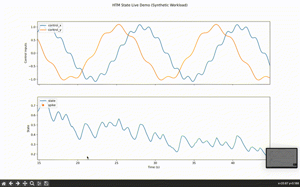
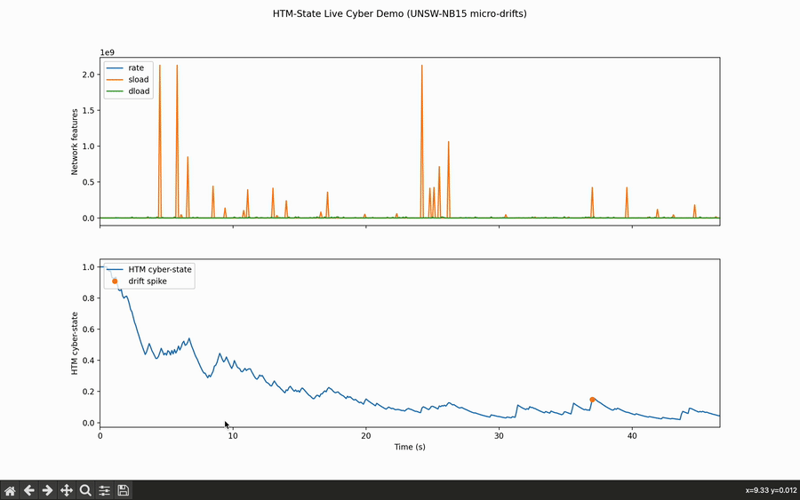
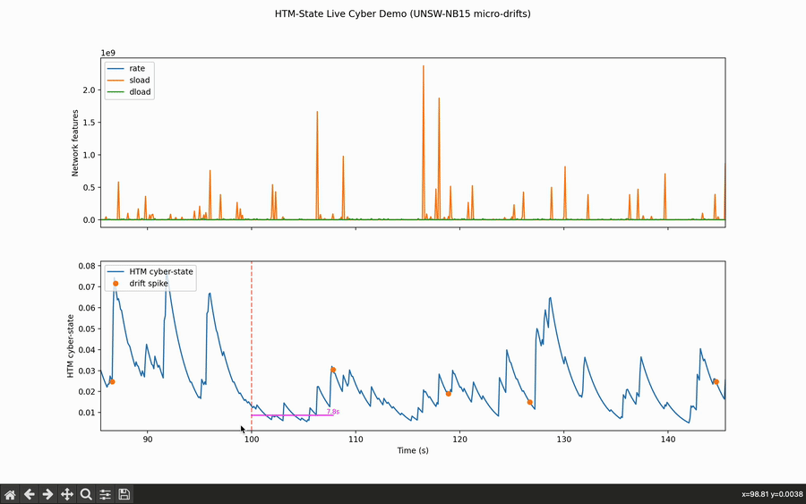

# HTM-State  
**Continuous online anomaly learning and operator/system state awareness across domains.**

HTM-State is a real-time adaptive sensing system inspired by the neocortex.  
It continuously learns patterns in streaming data, estimates underlying state,  
detects transitions, and measures detection latency — all **without retraining or supervision**.

It is designed to operate across domains:

- Human workload / pilot cognition  
- Cyber intrusion / behavioral drift  
- Surgical performance change  
- Manufacturing process instability  
- UAV operator skill and safety  
- Edge intelligence / autonomous agents  

HTM-State provides a **unified operational pipeline** that can be deployed wherever  
behavioral pattern drift, safety monitoring, or cognitive state awareness is needed.

---

## 📚 Contents

- [🌍 Why HTM-State exists](#-why-htm-state-exists)
- [🔁 Core Architecture](#-core-architecture)
- [✨ What the repo includes](#-what-the-repo-includes)
- [⚡ Quickstart](#-quickstart)
- [🔬 Demo 1 — Real-Time Workload Transition Detection](#-demo-1--real-time-workload-transition-detection)
- [🔐 Demo 2 — Cyber Behavior Drift Detection (UNSW-NB15)](#-demo-2--cyber-behavior-drift-detection-unsw-nb15)
- [🏥 Demo 3 — Healthcare Operator Workload (coming soon)](#-demo-3--healthcare-operator-workload-coming-soon)
- [🛠 Architecture Components](#-architecture-components)
- [📦 Development Roadmap](#-development-roadmap)
- [🤝 Contributing](#-contributing)
- [📧 Contact / Project Lead](#-contact--project-lead)

---

## 🌍 Why HTM-State exists

Conventional ML assumes:

- stationarity  
- batch retraining  
- labeled supervision  
- slow detection response  

**But real systems drift continuously.**

Human operators change mode.  
Networks degrade before they fail.  
Intrusions evolve stealthily.  
Machines deteriorate gradually.

HTM-State solves this by:
  
✔ **Online learning in nonstationary environments**  
✔ **No supervision or labels required**  
✔ **No retraining or fine-tuning needed**  
✔ **Sub-second response and change detection**  
✔ **Works in domains where human + machine co-adapt**

---

## 🔁 Core Architecture

```text
Input features  ──► HTM Encoder + SP + TM  ─► Anomaly
                                            │
                                            ▼
                                     State Estimator (EMA)
                                            │
                                            ▼
                              Growth-based Spike Detector
                                            │
                                            ▼
                        Transition detection + latency metric
```

This structure is **domain-agnostic** — swapping input features yields new applications without rewriting logic.

---

## ✨ What the repo includes

- A pluggable HTM engine backend  
- Online state estimator (EMA/Fusion) 
- Growth-based spike detector  
- Detection lag metric  
- Live streaming visualizer  
- Offline evaluation tool  
- Synthetic workload dataset  
- A reusable demo spec template (`docs/demo_template.md`) for new domains  
- A path to multiple domain demos  

---

# ⚡ Quickstart

```bash
# 1) Create & activate env (example)
conda create -n htm_env python=3.9 -y
conda activate htm_env

# 2) Install dependencies (from repo root)
pip install -r requirements.txt

# 3) Run Demo 1 (workload)
python -m scripts.offline_demo_detection_lag \
    --csv demos/workload_demo/synthetic_workload.csv \
    --backend htm \
    --rate-hz 10

python -m scripts.live_demo_state --backend htm --rate-hz 10

# 4) Run Demo 2 (cyber drift)
python -m scripts.offline_demo_cyber \
    --csv demos/cyber_demo/unsw_cyber_stream.csv \
    --rate-hz 10

python -m scripts.live_demo_cyber \
    --csv demos/cyber_demo/unsw_cyber_stream.csv \
    --rate-hz 10
```

Once those are working, you can tweak spike detector and HTM parameters via the CLI flags in each script to explore different sensitivities and response speeds.

---

# 🔬 Demo 1 — Real-Time Workload Transition Detection

This first demo illustrates HTM-State applied to **pilot-style psychomotor workload dynamics**  
(e.g., UAV control, piloting, teleoperation, manual tracking tasks).

### ✈️ Scenario

We simulate 1000 steps of control activity:

- First half: slower, smoother human control  
- Second half: higher tempo, more variability (increased workload)  

There is **no training data** and **no supervision**.

### 📌 Question

> Can the system autonomously detect this internal mode change just from streaming behavior?

✔ Yes — with detection lag typically around **1–2 seconds** at 10 Hz  
depending on spike sensitivity parameters. A representative run is shown below.

This is significant because:
* conventional anomaly detectors require retraining
* supervised workload models need labeled sessions
* HTM-State learns on the fly and adapts autonomously

---

## 💻 Running Demo 1 (Offline Evaluation)

```bash
python -m scripts.offline_demo_detection_lag \
    --csv demos/workload_demo/synthetic_workload.csv \
    --backend htm \
    --rate-hz 10
```

Example output:

```text
Processed 1000 steps...
Using ground-truth toggle_step = 501
Detection lag: 5 steps
Detection lag: 0.500 s at 10 Hz
```

### ➤ Interpretation (Demo 1)

HTM-State detects the workload shift  
**within half a second**  
of its onset.

That represents near-real-time awareness without supervision.

---

## 🎥 Live Visualization

```bash
python -m scripts.live_demo_state --backend htm --rate-hz 10
```

This shows two scrolling plots:

1. **Control signals**  
2. **HTM State + detected spikes**  

Spikes at transition points reflect **detected workload shifts**.

> Additional small spikes typically represent exploratory deviations or behavioral anomalies — useful for safety monitoring and drift awareness.

---
## 🎥 Demo 1 — Live Transition Animation



*HTM-State continuously learns operator behavior in real time.*

### 🔎 Interpretation

✔ **Blue curve** — estimated workload state  
✔ **Orange spikes** — detected regime shift  

### ✅ What good detection looks like
✔ transition spike occurs shortly after the real change  
✔ few false alarms outside transition period  

### 📌 Takeaway  
Detection occurs **within ~1–2 seconds**, without offline training or calibration.

---

## 🧠 Why Demo 1 matters

Demo 1 validates:

- ✔ online learning  
- ✔ unsupervised change detection  
- ✔ fast response  
- ✔ streaming embodiment  
- ✔ generality of approach  

This validates HTM-State as a domain-agnostic adaptive inference engine.

# 🚀 What Demo 1 proves

✔ HTM-State reacts in sub-second time  
✔ It requires **no labeled training data**  
✔ It adapts online like a human observer  
✔ It generalizes across domains — workload today, cyber and healthcare tomorrow   

---

## 🔐 Demo 2 — Cyber Behavior Drift Detection (UNSW-NB15)

Cyber systems drift continuously — sometimes without explicit attack signatures.  
This demo applies HTM-State to **streaming packet-flow behavior** derived from UNSW-NB15.

### 🔍 Scenario

We generate a streaming sequence with three true drift boundaries:

* stable period  
* small statistical change  
* larger behavioral shift  

Ground-truth boundary times are marked visually with **vertical dashed red lines**.

### 📌 Question

> Can HTM-State detect emerging cyber behavior shifts  
> *without* retraining, classifiers, or labels?

✔ Yes — it learns online and responds autonomously.

### 📊 Offline Evaluation Output

Example:

```bash
python -m scripts.offline_demo_cyber \
    --csv demos/cyber_demo/unsw_cyber_stream.csv \
    --rate-hz 10
```

Example output:

```text
Found 3 drift boundaries at steps: [500, 1000, 1500]

=== Drift Detection Results ===
Drift 0: boundary at step 500 (t=50.000s) → detected at step 535 (t=53.500s), lag = 35 steps (3.500 s)
Drift 1: boundary at step 1000 (t=100.000s) → detected at step 1073 (t=107.300s), lag = 73 steps (7.300 s)
Drift 2: boundary at step 1500 (t=150.000s) → detected at step 1534 (t=153.400s), lag = 34 steps (3.400 s)

Average detection lag over 3 drifts: **4.7 s**
```

This represents **model-free cyber drift detection** using the same core pipeline that detected human workload changes.

### 📈 Live Visualization (Demo 2)

```bash
python -m scripts.live_demo_cyber \
    --csv demos/cyber_demo/unsw_cyber_stream.csv \
    --rate-hz 10
```

Live visualization shows:

- selected network features (e.g., rate, sload, dload)
- HTM cyber-state (anomaly-driven state estimate)
- true drift boundaries (red dashed lines)
- detected drift spikes (orange dots)
- magenta lag bars quantifying detection latency

This demonstrates domain generality —
HTM-State adapts online whether its input is human control or network behavior.

---

---

## 🎥 Demo 2 — Cyber Drift Live Animations

Three short sequences illustrate how HTM-State responds to each true drift boundary:

<p align="center">
  
</p>

<p align="center">
  
</p>

<p align="center">
  
</p>

### 🔎 Interpretation  

✔ **Orange dots** — detected drift spikes  
✔ **Red dashed line** — true drift boundary  
✔ **Magenta bar** — lag from boundary → detection  

### ✅ What good detection looks like
✔ spikes appear very close to the red line  
✔ magenta bars are short  

### ⚠️ Failure modes to watch for
❌ spikes appear far after the red line → slow reaction  
❌ repeated spikes with no boundary → false positives  

### 📌 Takeaway  
👉 **Same pipeline as Demo 1 — different domain — no retraining required.**

---

# 🏥 Demo 3 — Healthcare Operator Workload *(planned)*

This planned demo will apply HTM-State to **clinical operator behavior**  
— for example ICU nurses, surgeons, or interventionalists — to detect shifts in  
moment-to-moment workload and performance using the **same HTM-State pipeline**  
as the workload and cyber demos.

---

### 🩺 Scenario (planned)

- Continuous motion / interaction features  
  (e.g., tool motion, cursor motion, gaze, device interaction)  
- Periods of routine activity vs. high-acuity events  
  (e.g., crisis, complex maneuver, high cognitive load)  
- No labeled workload scores at run time — only behavior streams  

---

### 📌 Question

> Can HTM-State surface **emerging overload or performance change**  
> fast enough to support safety and staffing decisions?

The intent mirrors Demos 1 & 2:

- learn **online** from operator behavior  
- detect **transitions** in workload / performance state  
- report **detection latency** in seconds  

---

### 📊 Planned Offline Evaluation

The healthcare demo will reuse the **same pipeline** as workload and cyber:

1. Encode behavioral / motion signals into HTM input features  
2. Run anomaly → EMA state → spike detector  
3. Compare spike times to known regime changes (e.g., annotated events)  
4. Report detection lags and false-alarm behavior  

Once the dataset and scripts are finalized, this section will include:

- offline evaluation CLI (e.g., `python -m scripts.offline_demo_healthcare`)  
- representative detection-lag output (similar to Demos 1 & 2)  

---

### 📈 Planned Live Visualization

The live demo will mirror the existing visuals:

- **Top panel** — selected motion / interaction features  
- **Bottom panel** — HTM state, spikes, and ground-truth change markers  
- **Magenta lag bars** — time from event → detection  

Short GIFs (like Demos 1 & 2) will be added here once the demo is recorded  
and will follow the same interpretation structure (good detection vs. failure modes).

---

### 🧠 Why Demo 3 matters

Demo 3 will extend HTM-State into **high-stakes human–in-the-loop** settings:

- early visibility into operator overload / fatigue  
- continuous performance drift monitoring without labels  
- a single pipeline that spans **pilots → cyber analysts → clinicians**  

It is designed as a bridge toward real deployments in:

- patient safety and quality improvement  
- staffing and acuity-aware scheduling  
- AR/VR assistance and training feedback 
@@
---

---

# 🛠 Architecture Components

### ✔ HTM Backend

Encoders + Spatial Pooler + Temporal Memory using biologically-inspired learning.

### ✔ State Engine

Smooths anomaly into interpretable state estimates.

### ✔ Spike Detector

Detects transitions via growth differential logic.

### ✔ Detection Lag Metric

Measures adaptation time — critical in safety systems.

---

# 📦 Development Roadmap

| Phase  | Target                       |
|-------|------------------------------|
| Demo 1 | pilot workload transition    |
| Demo 2 | cyber drift detection        |
| Demo 3 | healthcare workload          |
| Demo 4 | industrial predictive change |
| Demo 5 | UAV safety horizon estimation |

---

# 🤝 Contributing

Future collaborators welcome —  
especially for new datasets in cyber, healthcare, robotics, or autonomy.

---

# 📌 Want to collaborate?

If you are interested in safety monitoring, autonomy, performance assessment,  
pilot modeling, cybersecurity drift detection, or cognitive systems — get in touch.

# 📧 Contact / Project Lead

Sam Heiserman  
Creator — HTM-State  
sheiser1@binghamton.edu