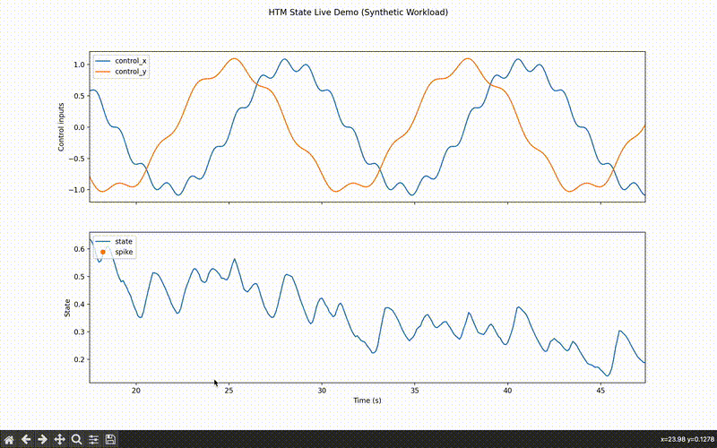
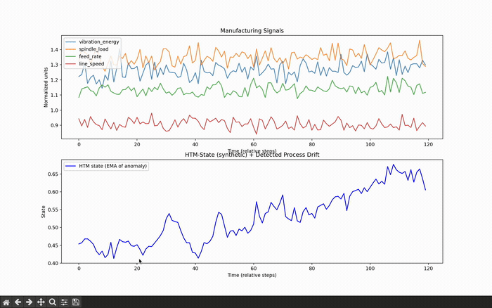

# HTM-State  
**Continuous online anomaly learning and operator/system state awareness across domains.**

HTM-State is a real-time adaptive sensing system inspired by the neocortex.  
It continuously learns patterns in streaming data, estimates underlying state,  
detects transitions, and measures detection latency — all **without retraining or supervision**.

It is designed to operate across domains:

- Human workload / pilot cognition  
- Cyber intrusion / behavioral drift  
- Surgical performance change  
- Manufacturing process instability  
- UAV operator skill and safety  
- Edge intelligence / autonomous agents  

HTM-State provides a **unified operational pipeline** that can be deployed wherever  
behavioral pattern drift, safety monitoring, or cognitive state awareness is needed.

---

## 📚 Contents

- [🌍 Why HTM-State exists](#-why-htm-state-exists)
- [🔁 Core Architecture](#-core-architecture)
- [✨ What the repo includes](#-what-the-repo-includes)
- [⚡ Quickstart](#-quickstart)
- [🔬 Demo 1 — Behavioral State Transition Detection](#-demo-1--behavioral-state-transition-detection-synthetic-control-task)
- [🔐 Demo 2 — Cyber Behavior Drift Detection](#-demo-2--cyber-behavior-drift-detection-unsw-nb15)
- [🏥 Demo 3 — Healthcare Operator Workload Detection](#-demo-3--healthcare-operator-workload-detection)
- [🏭 Demo 4 — Manufacturing Process Drift Detection](#-demo-4--manufacturing-process-drift-detection)
- [🛠 Architecture Components](#-architecture-components)
- [📦 Development Roadmap](#-development-roadmap)
- [🤝 Contributing](#-contributing)
- [📧 Contact / Project Lead](#-contact--project-lead)

---

## 🌍 Why HTM-State exists

Conventional ML assumes:

- stationarity  
- batch retraining  
- labeled supervision  
- slow detection response  

**But real systems drift continuously — often subtly.**

Human operators change mode.  
Networks degrade before they fail.  
Intrusions evolve stealthily.  
Machines deteriorate gradually.

HTM-State solves this by:
  
✔ **Online learning in nonstationary environments**  
✔ **No supervision or labels required**  
✔ **No retraining or fine-tuning needed**  
✔ **Sub-second response and change detection**  
✔ **Works in domains where human + machine co-adapt**

---

## 🔁 Core Architecture

```text
Input features  ──► HTM Encoder + SP + TM  ─► Anomaly
                                            │
                                            ▼
                                     State Estimator (EMA)
                                            │
                                            ▼
                              Growth-based Spike Detector
                                            │
                                            ▼
                        Transition detection + latency metric
```

This structure is **domain-agnostic** — swapping input features yields new applications without rewriting logic.

---

## ✨ What the repo includes

- A pluggable HTM engine backend  
- Online state estimator (EMA/Fusion) 
- Growth-based spike detector  
- Detection lag metric  
- Live streaming visualizer  
- Offline evaluation tool  
- Synthetic workload dataset  
- A reusable demo spec template (`docs/demo_template.md`) for new domains  
- A path to multiple domain demos  

---

## ⚡ Quickstart

```bash
# 1) Create & activate env (example)
conda create -n htm_env python=3.9 -y
conda activate htm_env

# 2) Install dependencies (from repo root)
pip install -r requirements.txt

# 3) Run Demo 1 (synthetic regime shift demo)
python -m scripts.offline_demo_detection_lag \
    --csv demos/workload_demo/synthetic_workload.csv \
    --backend htm \
    --rate-hz 10

python -m scripts.live_demo_state --backend htm --rate-hz 10

# 4) Run Demo 2 (cyber drift)
python -m scripts.offline_demo_cyber \
    --csv demos/cyber_demo/unsw_cyber_stream.csv \
    --rate-hz 10

python -m scripts.live_demo_cyber \
    --csv demos/cyber_demo/unsw_cyber_stream.csv \
    --rate-hz 10
```

Once those are working, you can tweak spike detector + HTM parameters via CLI flags  
to explore different sensitivities, detection latencies, and response profiles.

---

## 🔬 Demo 1 — Behavioral State Transition Detection (Synthetic Control Task)

HTM-State detects a **behavioral mode shift** in a simple human-in-the-loop  
control task. The system learns online from raw behavior streams and  
surfaces regime transitions with **sub-second latency** — no labels or retraining.

👉 **Full demo (offline + live + details):**  
[`docs/demo1.md`](docs/demo1.md)

---

### 🎥 Live Transition Example

<p align="center">
  
</p>

**Interpretation**

- **Blue trace** — estimated behavioral state  
- **Orange spikes** — detected transitions  
- **Detection lag**: typically **1–2 seconds** at 10 Hz  
- Zero-shot unsupervised detection — *no calibration, no training data*

This result supports HTM-State as a **fast, adaptive & precise change detector**  
for human control streams.

---

## 🔐 Demo 2 — Cyber Behavior Drift Detection (UNSW-NB15)

HTM-State detects **behavioral drift** in streaming network flow statistics  
derived from the UNSW-NB15 dataset. The system adapts online to shifting  
traffic patterns and surfaces **emerging anomalies without signatures** —  
no supervised classifiers or retraining loops.

👉 **Full demo (offline + live + details):**  
[`docs/demo2.md`](docs/demo2.md)

---

### 🎥 Live Drift Example

<p align="center">
  
</p>

**Interpretation**

- **Blue trace** — estimated cyber-state (EMA of anomaly)  
- **Orange spikes** — detected behavior shifts  
- **Red dashed lines** — true drift boundaries  
- **Magenta bars** — detection lag  
- Typical detection latency: **3–7 seconds at 10 Hz**

HTM-State identifies **multi-stage drift** in network behavior without attack labels,  
maintaining low false alarms. This demonstrates strong generalization from  
human control streams (Demo 1) to cyber traffic behavior.

---

## 🏥 Demo 3 — Healthcare Operator Workload Detection

HTM-State monitors **clinical operator behavior** (e.g., ICU nurses, surgeons)  
to detect **workload transitions and emerging overload states** in real time.  
The same unsupervised online pipeline from Demos 1 & 2 applies —  
no labels, no per-operator calibration.

👉 **Full demo (offline + live + details):**  
[`docs/demo3.md`](docs/demo3.md)

---

### 🎥 Live Workload Transition Example

<p align="center">
  
</p>

**Interpretation**

- **Blue trace** — HTM-State (EMA of anomaly)  
- **Orange spikes** — detected workload transitions  
- **Red dashed line** — true transition to overload  
- **Magenta bar** — detection lag  
- Typical detection latency: **~0.1–1.0 seconds at 10 Hz**

This shows HTM-State generalizing seamlessly into **high-stakes human-in-the-loop** domains,  
learning online and detecting workload changes without supervised data or retraining.

---

## 🏭 Demo 4 — Manufacturing Process Drift Detection

HTM-State monitors **multi-sensor manufacturing behavior** to surface  
**emerging drift, instability, and pre-fault transitions** in real time.  
The same unsupervised online pipeline from Demos 1–3 applies —  
no labels, no per-machine calibration, no retraining loop.

👉 **Full demo (offline + live + details):**  
[`docs/demo4.md`](docs/demo4.md)

---

### 🎥 Live Drift Transition Example

<p align="center">
  
</p>

**Interpretation**

- **Blue trace** — HTM-State (EMA of anomaly)  
- **Orange spikes** — detected process drift  
- **Red dashed line** — true onset of high-drift / pre-fault behavior  
- **Magenta bar** — detection lag  
- Typical detection latency: **~1–3 seconds @ 10 Hz**

This demonstrates HTM-State’s ability to detect  
**slow, noisy industrial process drift** using the same model-free  
change-detection pipeline validated in earlier demos.

---

# 🛠 Architecture Components

### ✔ HTM Backend

Encoders + Spatial Pooler + Temporal Memory using biologically-inspired learning.

### ✔ State Engine

Smooths anomaly into interpretable state estimates.

### ✔ Spike Detector

Detects transitions via growth differential logic.

### ✔ Detection Lag Metric

Measures adaptation time — critical in safety systems.

---

## 📦 Development Roadmap

| Phase  | Target |
|-------|------------------------------|
| Demo 1 | synthetic control state transition (complete — offline + live) |
| Demo 2 | cyber drift detection              (complete — offline + live) |
| Demo 3 | healthcare workload                (complete — offline + live) |
| Demo 4 | industrial predictive change       (complete — offline + live) |
| Demo 5 | UAV safety horizon estimation      (TODO) |

---

## 🤝 Contributing

Future collaborators welcome — especially for new datasets in  
cyber, healthcare, robotics, manufacturing, autonomy, or aviation.

---

## 📌 Want to collaborate?

If you're interested in safety monitoring, autonomy, behavior modeling,  
cybersecurity drift detection, or cognitive systems — get in touch.

## 📧 Contact / Project Lead

Sam Heiserman  
Creator — HTM-State  
sheiser1@binghamton.edu