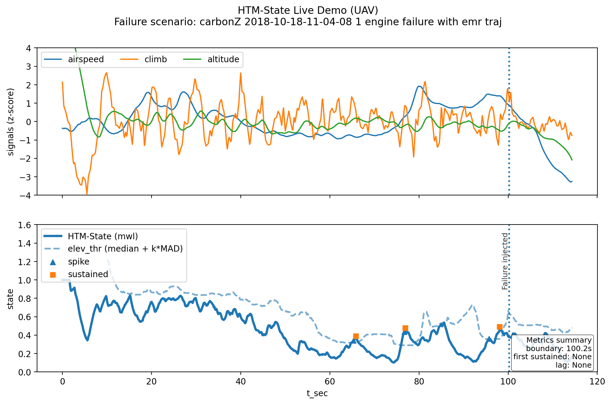

# UAV Demo (ALFA Dataset)


This demo evaluates **HTM-State** on real UAV flight data from the **ALFA (Autonomous Learning Flight Arena)** dataset.

Rather than relying on a small number of hand-selected examples, we perform an **offline sweep across all eligible ALFA runs**, spanning:

- Engine failures  
- Control-surface failures (aileron, rudder, elevator)  
- Multi-fault scenarios  
- No-failure baselines  

The goal is to assess, in a broad and systematic way, whether HTM-State shows **early, stable, and interpretable detection behavior** across diverse failure modes — and to quantify that behavior using simple, transparent metrics.

After the offline sweep, a small number of representative runs are selected for **live streaming visualizations**, which provide intuition but do not drive the reported results.

## What HTM-State is telling us operationally

This demo shows that **HTM-State behaves less like a generic anomaly detector
and more like a workload / control-regime indicator** when applied to real UAV flight data.

Across the full ALFA sweep — spanning engine failures, control-surface failures,
 multi-fault scenarios, and no-failure baselines — a small number of *repeatable response
patterns* emerge consistently, using a single unsupervised configuration.

### Key operational takeaways

**1. HTM-State differentiates compensable vs. non-compensable failures**

- Engine failures often trigger **fast spikes** but little or no sustained elevation.
- Control-surface and multi-fault failures reliably produce **persistent elevation**.

This distinction emerges *without labels or tuning* and aligns closely with
operational intuition: some failures are noticed but managed, while others
create sustained control difficulty.

**2. Non-commitment is a feature, not a miss**

Several runs include a strict failure boundary but **no sustained detection**.
These cases are retained intentionally.

HTM-State does not force commitment when the underlying control behavior
does not remain abnormal — a critical property for real operational systems
where false commitments are costly.

**3. Detection is time-aligned, not instantaneous**

Detection lags are measured in seconds to tens of seconds, not single timesteps.
This reflects gradual workload emergence rather than threshold crossing,
and avoids the brittleness of instantaneous alarms.

**4. Persistence carries more meaning than spikes**

- Spike detections indicate *awareness of change*
- Sustained elevation indicates *prolonged regime shift*

Only sustained elevation is treated as an **operational signal** in this demo.
Spikes are reported to characterize sensitivity and false-alarm behavior,
not as sufficient conditions for intervention.

**5. Severity scales monotonically with failure complexity**

Across the full roster:

```
engine failures  <  single control-surface failures  <  multi-fault scenarios
```

This ordering is visible in:
- post-boundary elevation fraction
- maximum HTM-State magnitude
- stability of sustained detection

No failure-specific thresholds are used to induce this separation.

---

**Bottom line:**  
HTM-State appears to track *control difficulty and workload persistence*,
not just signal novelty — a property that is difficult to achieve with
static anomaly scores alone.

## At a glance

### What a live run looks like



*Top: normalized flight signals. Bottom: HTM-State with spike and sustained detections relative to the injected failure boundary.*

**Figure 1** summarizes detection performance, latency, and persistence across all ALFA UAV failure types under a strict, unsupervised evaluation protocol.


> Spike-based and sustained-elevation detection capture complementary workload dynamics.  
> Control-surface and multi-fault scenarios exhibit higher persistence than compensable engine failures.

<details>
<summary><b>Dataset and evaluation scope</b></summary>

This demo uses flight logs from the **ALFA UAV dataset**, after preprocessing and stream generation.  
All evaluation is performed on per-run CSV streams located under:

```
demos/uav/generated/
```

Each CSV corresponds to a single UAV flight and is written under:

```
demos/uav/generated/streams/{failure_type}/{run_id}.csv
```
- Time index (`t_sec`)
- Flight and control features
- A binary ground-truth failure boundary (`is_boundary`) when available

Runs are **included** if required columns are present and a failure boundary exists; runs without ground truth or with malformed streams are **excluded** and logged.

Failure type is inferred directly from the source folder name (e.g., `engine_failure`, `rudder_failure`, `multi_fault`), allowing the sweep to scale without additional metadata.

Examples:
- `carbonZ_..._engine_failure` → `engine_failure`
- `carbonZ_..._rudder_left_failure` → `rudder_failure`
- `carbonZ_..._left_aileron__right_aileron__failure` → `multi_fault`
- `carbonZ_..._no_failure` → `no_failure`

This lightweight name-based classification allows the sweep to scale cleanly across the entire ALFA dataset without additional metadata.
</details>


<details>
<summary><b>Metrics definition</b></summary>

Each UAV run is evaluated independently using a small set of transparent, time-aligned metrics derived from the HTM-State output. These metrics are designed to capture **timeliness**, **stability**, and **false-alarm behavior** relative to a known failure boundary.

### Primary metric: detection lag

Detection lag measures how quickly HTM-State responds after a known failure boundary.

Two complementary detection mechanisms are evaluated:

#### 1. Spike detection lag
- A **spike** is defined as a sharp increase in HTM-State relative to its recent history.
- Detection lag is computed as the elapsed time between the failure boundary and the **first spike occurring at or after the boundary**.

This captures fast, edge-like responses to abrupt changes.

#### 2. Sustained elevation lag
- A **sustained elevation** occurs when HTM-State remains above a threshold for a minimum hold duration.
- The threshold is computed from **pre-boundary state statistics** (median + *k*·MAD or equivalent).
- Detection lag is the elapsed time between the failure boundary and the first sustained elevation event.

This captures slower but more stable regime changes.

Both lags are reported in **seconds** when a boundary is present.

### Secondary metric: false alarms before boundary

False alarms quantify spurious detections **before** the failure occurs.

- Measured as the **rate of spike events per minute** in the pre-boundary interval.
- For `no_failure` scenarios, this metric is computed over the entire run.

Low false-alarm rates indicate stability under nominal conditions.

### Secondary metric: post-boundary persistence

Post-boundary persistence measures how strongly HTM-State remains elevated after a failure.

- Defined as the **fraction of post-boundary timesteps** where HTM-State exceeds the pre-boundary threshold
  (`post_elev_frac`).
- Values near 1.0 indicate sustained abnormal state; values near 0.0 indicate weak or transient response.

This metric complements detection lag by capturing **severity and consistency**, not just speed.

### Secondary metric: post-boundary severity

Severity captures how large the HTM-State response becomes after a failure.

- Measured as the **maximum HTM-State value observed after the boundary**
  (`max_state_post_boundary`).

This distinguishes mild but persistent workload increases from sharp, high-amplitude responses.

### Secondary metric: overall spike activity

- `n_spikes_total` counts the total number of spike events over the full run.

This provides a simple global measure of volatility and complements the
pre-boundary false-alarm rate.

### Applicability notes

- For runs without a failure boundary (`no_failure`), detection lag metrics are not applicable.
- All metrics are computed without using future information beyond the current timestep.
</details>

## Evaluation framing (important)

This demo intentionally distinguishes between **sensitivity** and **operational relevance**.

- **Spike detections** indicate that HTM-State noticed a change or novelty.
- **Sustained elevation** indicates a prolonged control or workload regime shift.

Only sustained elevation is treated as an **operational detection** signal.
Spike detections are reported to characterize responsiveness and false-alarm behavior,
but are not sufficient on their own to justify intervention.

This distinction is maintained consistently across metrics, tables, figures, and live visualizations.

## Results summary

The offline sweep produces two primary result tables:

### Interpreting HTM-State across failure types

Before examining individual runs, it is useful to summarize the *qualitative behavior* that emerges consistently across the full roster of ALFA UAV failures.

Despite wide variation in airframe dynamics, control authority, and pilot compensation strategies, HTM-State exhibits a small number of *repeatable response modes* that align closely with operational intuition.

These modes are not hand-coded and do not depend on failure labels; they emerge from a single unsupervised configuration applied uniformly across all runs.

---

## Final roster of representative runs

The table below lists the fixed set of UAV runs used for live visualization
and qualitative illustration throughout this document.

Runs are selected *after* the full offline sweep and are chosen to represent
distinct HTM-State response regimes — not visual appeal.

| Failure type | Run ID | Spike? | Sustained? | Sustained lag (s) | Post-elev frac | Max state post | Notes |
|-------------|--------|--------|------------|------------------:|---------------:|---------------:|-------|
| No failure | carbonZ_2018-10-18-11-08-24_no_failure | No | No | — | — | — | Stable baseline (not in strict per_run.csv) |
| Engine | carbonZ_2018-10-18-11-04-08_1_engine_failure_with_emr_traj | Yes | No | — | 0.000 | 0.525 | Compensable spike-only response |
| Engine | carbonZ_2018-09-11-14-22-07_2_engine_failure | No | No | — | 0.000 | 0.801 | Hard / ambiguous (weak response) |
| Elevator | carbonZ_2018-09-11-14-41-51_elevator_failure | No | Yes | 2.500 | 0.762 | 0.709 | Sustained-only (clean regime shift) |
| Elevator | carbonZ_2018-09-11-15-05-11_1_elevator_failure | Yes | No | — | 0.000 | 0.719 | Spike-only (no persistence) |
| Rudder | carbonZ_2018-09-11-15-06-34_2_rudder_right_failure | Yes | No | — | 0.000 | 0.807 | Spike-only (no persistence) |
| Multi-fault | carbonZ_2018-09-11-14-52-54_left_aileron__right_aileron__failure | Yes | Yes | 10.700 | 0.064 | 0.502 | Delayed sustained, low persistence fraction |
| Multi-fault | carbonZ_2018-09-11-17-27-13_1_rudder_zero__left_aileron_failure | Yes | Yes | 0.000 | 0.941 | 0.594 | Immediate + highly persistent elevation |

Metric values shown are derived directly from `per_run.csv` (strict boundary inclusion).
The `no_failure` baseline row is included for narrative reference but is not part of the strict per-run table.

The following derived columns are treated as **frozen evaluation artifacts**
and are not re-tuned for visualization:

- `post_elev_frac`
- `max_state_post_boundary`
- `n_spikes_total`

---

### Pattern 1: Fast but transient responses in compensable failures

Single-engine failure scenarios frequently produce:

- One or more **spike detections** shortly after the injected failure boundary
- Limited or absent **sustained elevation** of HTM-State (`post_elev_frac` near zero)
- Low post-boundary persistence

This pattern reflects failures that are *detectable* but *largely compensable*, often due to pilot adaptation, trim changes, or trajectory assistance (e.g., EMR).

Operationally, these runs are important because:
- A fast spike indicates that the system *noticed something changed*
- The absence of sustained elevation indicates that workload did not remain elevated

HTM-State therefore avoids over-committing in cases where the disturbance is managed successfully.

Importantly, several engine-failure runs do not trigger sustained elevation at all
(`sustained_detected = False`), despite clear transient spikes.

---

### Pattern 2: Sustained elevation in control-surface failures

Elevator, aileron, and rudder failures — especially when persistent — consistently produce:

- Clear **sustained elevation** following the failure boundary
- Moderate detection lags (typically seconds to tens of seconds)
- High post-boundary persistence

In these runs, the flight signals often degrade gradually rather than abruptly.
HTM-State responds accordingly, transitioning into an elevated regime rather than producing only brief novelty spikes.

This behavior aligns with the interpretation of HTM-State as a **workload / control-regime indicator**, not a raw anomaly detector.

Across the full roster, post-boundary persistence (`post_elev_frac`) increases monotonically from:
engine failures → single control-surface failures → multi-fault scenarios.

This trend emerges without failure-specific tuning and serves as a strong indicator that
HTM-State is responding to **control difficulty**, not merely signal disruption.

Median `max_state_post_boundary` also increases across this ordering,
indicating not only longer persistence but greater response magnitude.

---

### Pattern 3: Strong and persistent responses in multi-fault scenarios

Multi-control-surface failures (e.g., rudder + aileron) produce the most robust HTM-State responses:

- Sustained elevation occurs reliably
- Post-boundary persistence is high
- Detection remains stable even when individual signal channels fluctuate

These scenarios represent prolonged, non-compensable control challenges.
HTM-State correctly treats them as such, remaining elevated rather than oscillating.

---

### Pattern 4: Non-commitment is a feature, not a failure

Several runs include a strict failure boundary but **no sustained detection**.

These cases are not excluded.
Instead, they illustrate an important property:

> HTM-State does not force a detection when the underlying control behavior does not remain abnormal.

This behavior is critical for operational use, where false commitments are often more costly
than delayed or absent detections.

---

### Detection signals and operational interpretation

HTM-State produces two qualitatively different detection signals:

1. **Spike detections** — fast, transient responses to novelty or abrupt change  
2. **Sustained elevation** — persistent state increases indicating a prolonged control or workload regime shift

Both are reported throughout this demo, but **they are not treated as equivalent**.

**Sustained elevation is the primary operational signal.**
It reflects conditions that persist long enough to justify intervention, escalation, or mode switching.

Spike detections are retained as a **secondary sensitivity indicator**, useful for:
- understanding early system awareness,
- diagnosing abrupt transitions,
- and characterizing compensable vs non-compensable failures.

This distinction is critical for operational relevance and is maintained consistently in all reported metrics, tables, and visualizations.

---

### Overview and key findings

The strict offline sweep across the ALFA UAV dataset demonstrates that **HTM-State exhibits consistent, fault-dependent behavior across diverse failure modes**, using a single unsupervised configuration and without per-scenario tuning.

Several high-level patterns emerge:

- **Detection behavior is strongly failure-type dependent.**  
  Control-surface and multi-fault scenarios are detected more reliably than engine failures, reflecting differences in how faults manifest in pilot control behavior.

- **Spike-based detection and sustained elevation capture complementary phenomena.**  
  Abrupt faults often produce transient novelty (spikes), while non-compensable control degradations produce prolonged state elevation. These mechanisms should not be conflated.

- **Detection latency is measured in seconds, not instantaneous steps.**  
  Median detection lags range from several seconds to tens of seconds depending on fault type, consistent with gradual workload emergence rather than threshold-triggered alarms.

- **False alarms remain bounded under nominal conditions.**  
  Pre-boundary spike rates remain low across all failure types, including no-failure baselines, indicating stability rather than hypersensitivity.

- **Post-boundary state persistence distinguishes compensable vs. sustained failures.**  
  Engine failures tend to show transient responses with low persistence, while elevator, aileron, and multi-fault scenarios exhibit sustained elevation consistent with prolonged workload impact.

These trends are summarized visually in **Figure 1**, which aggregates detection rate, latency, and persistence across all evaluated runs.

> **Figure 1 (Summary).** HTM-State benchmark performance on the ALFA UAV dataset under a strict, unsupervised evaluation protocol.  
> (A) Detection rates by failure type for spike-based and sustained-elevation mechanisms.  
> (B) Distribution of spike detection latency across failure types.  
> (C) Relationship between post-boundary state persistence and false-alarm rate, highlighting separation between compensable and non-compensable failures.

1. A **per-run results table**, containing one row per UAV flight
2. An **aggregated summary table**, grouped by failure type

These tables are generated automatically and saved alongside the demo results.

### Per-run results table

The per-run table provides a complete, auditable record of HTM-State behavior on each individual flight.

Each row corresponds to a single generated UAV stream.

| Column | Description |
|------|------------|
| `run_id` | Unique identifier (derived from source folder / CSV name) |
| `failure_type` | One of: `engine_failure`, `aileron_failure`, `rudder_failure`, `elevator_failure`, `multi_fault`, `no_failure` |
| `has_boundary` | Boolean indicating whether a ground-truth boundary exists |
| `boundary_time_s` | Failure injection time (seconds), if applicable |
| `spike_detected` | Whether a spike was detected after the boundary |
| `spike_lag_s` | Detection lag to first spike (seconds) |
| `sustained_detected` | Whether a sustained elevation was detected |
| `sustained_lag_s` | Detection lag to sustained elevation (seconds) |
| `false_alarms_spm` | Spike rate before boundary (spikes per minute) |
| `post_elev_frac` | Fraction of post-boundary timesteps where HTM-State exceeds threshold |
| `max_state_post_boundary` | Maximum HTM-State after boundary |
| `n_spikes_total` | Total number of spike events during the run |

This table is used both for quantitative reporting and for selecting representative runs for visualization.

**Output file:** `demos/uav/generated/results/uav_sweep/summary_by_type.csv`

Together, these metrics distinguish:
- **transient detections** (early spike, low persistence),
- **sustained workload regimes** (high persistence),
- and **severity differences** between failure modes.

These columns are used directly for run selection and qualitative interpretation.

## Quantitative results

### Aggregated results by failure type

Notes:
- Detection rates are computed as the fraction of runs where detection occurred.
- Median lags are computed only over detected runs.
- For `no_failure`, detection lag metrics are not applicable; false alarms are the primary indicator.

Notably, HTM-State exhibits increasing post-boundary persistence from engine to control-surface to multi-fault scenarios, consistent with increasing workload severity rather than mere novelty.

This monotonic trend across failure categories is particularly notable because:

- No failure-specific thresholds are used
- No labels are used during inference
- The same state variable is interpreted consistently across all scenarios

---

**Output file:** `results/uav_sweep/summary_by_type.csv`

## Live animations (recommended for first-time readers)

The live visualizations are included **solely to build intuition**, not to drive the quantitative results.

They do not introduce new evidence and are not required to interpret or validate the tables above.

Final MP4 clips will be generated directly from the same per-run CSVs used in the offline sweep.

All metrics and conclusions are derived exclusively from the offline sweep.
The animations simply illustrate *why* the metrics behave as they do.

These clips show the **two-panel live view** used throughout this demo:

- **Top panel**: selected flight/control signals (what the airframe is doing / what the controller is commanding).
- **Bottom panel**: HTM-State outputs (state, spikes, sustained elevation), plus the **strict benchmark boundary** when available.

### 1) Baseline (no failure)

Use this as a “what normal looks like” reference. There is **no ground-truth boundary** in no-failure runs, so we show a
representative stable window (often mid-run or late-run, after warm-up).

<video controls playsinline width="900">
  <source src="generated/media/uav_no_failure_baseline.mp4" type="video/mp4">
</video>

*(Placeholder — final video will reflect stable HTM-State with low spike activity and no sustained elevation.)*

**How to read it:** you want **low anomaly/spike activity** and no sustained elevation over long stretches.

### 2) Engine failure (transition window)

This clip focuses on the failure transition window for an engine-failure run.

<video controls playsinline width="900">
  <source src="generated/media/uav_engine_failure_transition.mp4" type="video/mp4">
</video>

*(Placeholder — final video will show a transient spike followed by partial or absent sustained elevation, illustrating a compensable failure.)*

**How to read it:** the vertical boundary line marks the strict “toggle” time. A clean detection shows (i) **spikes after**
the boundary and/or (ii) a sustained elevated state after the boundary with limited pre-boundary false alarms.
This particular clip is a **hard case** (useful as a miss/ambiguity example).

### 3) Control-surface multi-fault (transition window)

This clip shows a “control surfaces” multi-fault style run (e.g., rudder/aileron related).

<video controls playsinline width="900">
  <source src="generated/media/uav_control_surface_failure_transition.mp4" type="video/mp4">
</video>

*(Placeholder — final video will show delayed but persistent HTM-State elevation consistent with prolonged control difficulty.)*

**How to read it:** compare pre-boundary vs post-boundary behavior. In tough cases the signals may degrade gradually,
and strict scoring will penalize **pre-boundary spikes** as false alarms even if they look like plausible precursors.

### Final roster selection logic

Live visualizations are selected *after* the full offline sweep and are used only to illustrate patterns already present in the quantitative results.

Selection is deterministic and based on the per-run metrics:

For each failure type, we include:

1. **Typical sustained case**  
   - Sustained elevation detected
   - `sustained_lag_s` near the median for that failure type
   - High `post_elev_frac` and high `max_state_post_boundary`

2. **Fast transient (spike-only) case**  
   - Spike detected shortly after boundary  
   - No sustained elevation  
   - Low `post_elev_frac`, often with non-zero `n_spikes_total`

3. **Hard or ambiguous case**  
   - Late detection, weak persistence, or borderline behavior
   - Often characterized by moderate `n_spikes_total` but low `post_elev_frac`

4. **Baseline (no-failure) case**  
   - Low spike rate  
   - No sustained elevation  
   - Demonstrates stability under nominal conditions

Runs are *not* selected based on visual appeal.
They are selected to represent **distinct HTM-State response regimes** that recur across the dataset.

### Visualization method

Each selected run is visualized using the live streaming demo:
- Flight signals (display-normalized)
- HTM-State output
- Spike detections
- Sustained elevation threshold and events
- Ground-truth failure boundary (when present)

### Figure organization

Generated figures are stored under:

```
demos/uav/generated/figures/selected/{failure_type}/{figure}.png
```

## Reproducibility

### 1. Prepare raw ALFA logs

Run from the repo root:

    python scripts/copy_data_uav.py \
      --processed-dir /path/to/ALFA/processed \
      --include-optional

Raw scenarios are copied under:

```
demos/uav/raw/
```

### 2. Generate per-run UAV stream CSVs

    python scripts/generate_stream_uav.py \
      --raw-dir demos/uav/raw \
      --out-dir demos/uav/generated/streams

Artifacts are written under:
- `demos/uav/generated/results/uav_sweep/` (coverage/per_run/summary CSVs + Figure 1)
- `demos/uav/generated/figures/selected/` (representative per-run PNGs)
- `demos/uav/generated/media/` (short MP4 clips used in this doc)

### 3. Run the offline sweep

    python scripts/run_offline_uav.py \
      --generated-dir demos/uav/generated/streams \
      --outdir demos/uav/generated/results/uav_sweep

This produces:
- `demos/uav/generated/results/uav_sweep/per_run.csv`
- `demos/uav/generated/results/uav_sweep/summary_by_type.csv`
- `demos/uav/generated/results/uav_sweep/coverage.csv`

### 4. Generate live visualizations (optional)

    python scripts/run_live_uav.py \
      --per-run demos/uav/generated/results/uav_sweep/per_run.csv \
      --coverage demos/uav/generated/results/uav_sweep/coverage.csv \
      --outdir demos/uav/generated/figures/selected

<details>
<summary><b>Representative plot gallery (auto-generated)</b></summary>

<!-- AUTO-GALLERY:BEGIN -->

> This section is generated from `demos/uav/selected_runs.yaml` (do not edit by hand).

### `no_failure`

| Example | Plot | Run ID | Quick metrics |
|---|---:|---|---|
| **Baseline (no failure)** |  | `carbonZ_2018-10-18-11-08-24_no_failure` | — |

### `engine_failure`

| Example | Plot | Run ID | Quick metrics |
|---|---:|---|---|
| **Typical spike** |  | `carbonZ_2018-10-18-11-04-08_1_engine_failure_with_emr_traj` | — |
| **Hard spike** |  | `carbonZ_2018-09-11-11-56-30_engine_failure` | — |
| **Miss** |  | `carbonZ_2018-09-11-14-22-07_2_engine_failure` | — |

### `elevator_failure`

| Example | Plot | Run ID | Quick metrics |
|---|---:|---|---|
| **Typical spike** |  | `carbonZ_2018-09-11-15-05-11_1_elevator_failure` | — |
| **Sustained-only** |  | `carbonZ_2018-09-11-14-41-51_elevator_failure` | — |

### `rudder_failure`

| Example | Plot | Run ID | Quick metrics |
|---|---:|---|---|
| **Typical spike** |  | `carbonZ_2018-09-11-15-06-34_2_rudder_right_failure` | — |
| **Hard spike** |  | `carbonZ_2018-09-11-15-06-34_1_rudder_right_failure` | — |

### `multi_fault`

| Example | Plot | Run ID | Quick metrics |
|---|---:|---|---|
| **Typical spike** |  | `carbonZ_2018-09-11-14-52-54_left_aileron__right_aileron__failure` | — |
| **Hard spike** |  | `carbonZ_2018-09-11-17-27-13_1_rudder_zero__left_aileron_failure` | — |

<!-- AUTO-GALLERY:END -->

</details>

